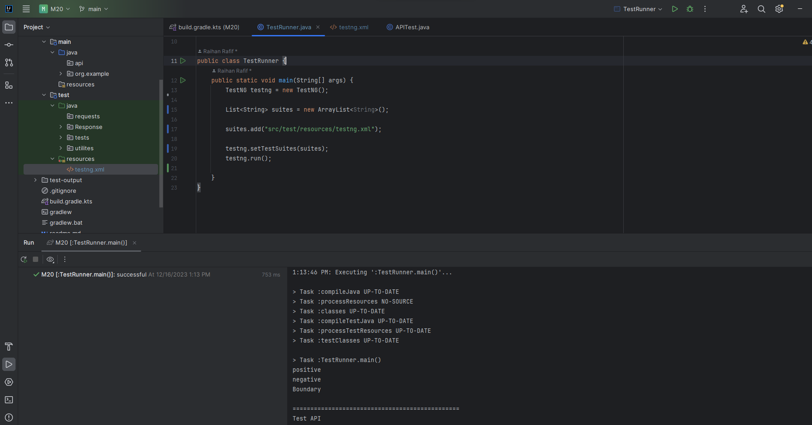

# Otomasi_API

* Membuat Kerangka Otomasi API dengan Java dan otomatiskan beberapa kasus.

* Menggunakan framework testing TestNG.

* Dengan struktur :

- src
    - main
       
    - test
        - java
            - tests
                - APITest.java
            - utilities
                - TestRunner.java (untuk melaksanakan tes dan menghasilkan laporan pengujian)
        - resources
            - testng.xml

* Cara melakukan testing adalah :
  Running code pada TestRunner.java

